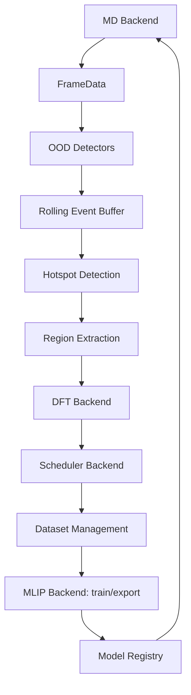

# PHAL — Physics-aware Hotspot Active Learning Platform

## Validated Runtime Matrix

The frozen Milestone 3 baseline is tagged `milestone3-md-probe` at commit
`8ea02ebdb460153a403e046aa4434ef2b8bb7dba`.

| Component | Validated baseline |
| --- | --- |
| Docker/OCI platform | Linux ARM64 |
| Apptainer | 1.3.5 |
| GPU | NVIDIA GH200 120GB, capability 9.0 |
| CUDA runtime | 13.0 |
| Torch | 2.9.0a0+50eac811a6.nv25.09 |
| NequIP | 0.18.0 |
| Allegro | 0.8.3 |
| LAMMPS | 10 Sep 2025 |
| pair backend | official pair_nequip_allegro v0.7.0, allegro/kk |
| Train OCI | sha256:513aeaf7e997caa3b743ecc4b7c4d0defdfabd01a13de3f83841f2dc21810e86 |
| Train SIF | fd0e73861d22fce07b7d920ea406c3185db916bed93aa3fba5ca14d9f022bc47 |
| MD OCI | sha256:d684ffa628091e6277c3f4b98c4de6cd5ef53aa59b210387f253ac0b5e957885 |
| MD SIF | 0b6307d80fff7a94aa69b807194854dc05d30fba6fe463f41d8906aace923627 |
| Probe model | 0c800c6d94f697f461033c8ec19c0b52cc587bac873d07dd7435955a06aa2f54 |

See [`docs/releases/milestone3-baseline.md`](docs/releases/milestone3-baseline.md)
for scope, limitations, and evidence references.

`hotspot_al` 是面向大规模反应型 MLIP-MD 的局域热点主动学习平台。PHAL 在逐原子
尺度检测异常事件，只截取需要高精度标注的局域区域，并生成带区域掩码的数据，避免
将整帧大体系送入 DFT。

PHAL 的领域逻辑与外部科学软件解耦。OOD 检测、热点聚类、block-aware relabeling、
候选池、数据管理和工作流调度只依赖稳定的 Backend 接口，不直接调用 Allegro、
LAMMPS、CP2K 或具体队列系统。

## 第一原则

**Physics-aware Active Learning 是 PHAL 唯一的核心业务逻辑。**

CP2K、LAMMPS、Allegro 及任何未来计算软件都属于 Infrastructure：它们可以替换、
迁移或扩展，但不能决定算法层的模型、模块边界和演进方向。架构决策必须优先保护
Core Domain 的稳定性和可测试性。

具体约束如下：

- Core Domain 不导入任何具体 MLIP、MD、DFT、调度器或进程启动实现；
- 算法输入输出使用 `FrameData`、`OODFrameResult`、`ExtractedRegion`、`EventRecord`
  等领域模型；
- Application/Workflow 层只能通过 Backend Interface 请求外部能力；
- Infrastructure 负责软件输入、执行、解析、运行状态、日志和错误翻译；
- 新增或替换计算软件不得要求修改 OOD、热点检测、区域截取、候选选择和数据语义；
- 依赖边界由 `tests/architecture/test_core_domain_boundaries.py` 自动检查。

这里的“无外部依赖”是指不依赖具体科学软件和运行环境。NumPy、ASE 等通用数值与
原子数据基础属于受控技术依赖，不携带某个计算后端的业务语义。

> 当前状态：research prototype / validation in progress。核心离线流程、Backend
> 插件架构和 fake-backend 端到端测试可用；生产运行仍需要用户提供模型、科学软件、
> 站点资源参数及训练/导出命令，并完成对应体系的科学验证。

## 核心能力

- 逐原子 OOD 监测：force、force burst、displacement、最近邻距离、配位变化、
  LJ projection residual、committee deviation 和 MLIP force deviation；
- `light` / `physics` / `full` 分阶段评分，减少昂贵指标的调用频率；
- event-triggered pre/trigger/post frame 缓存；
- cluster、slab、graph、block 四种局域区域截取方式；
- block 空间网格、相邻异常块合并、halo、cooldown 和 frozen boundary；
- 保守式 H capping、边界区域标记及 point-charge embedding 接口；
- `extxyz + npz + metadata` 数据输出和逐原子训练权重；
- 样本数、时间间隔或手动触发的重训练流程；
- 模型注册、部署、热加载和回滚；
- 配置驱动的 Backend 工厂、注册表及 Python entry-point 插件发现；
- Local、Slurm、PBS 调度适配器和统一任务状态模型。

## 平台架构



核心依赖方向为：

```text
detectors / datasets / active-learning policy
                    ↓
                workflows
                    ↓
     MLIP / MD / DFT / Scheduler interfaces
                    ↓
         built-in or external plugins
```

统一接口定义在
[`src/hotspot_al/backends/base.py`](src/hotspot_al/backends/base.py)：

- `MLIPBackend`：单模型推理、committee、训练、导出和模型热加载；
- `MDBackend`：MD 执行请求与轨迹读取；
- `DFTBackend`：输入生成、执行请求、完成状态检查和结果解析；
- `SchedulerBackend`：任务提交、轮询和取消；
- `ExecutionRequest`：在科学后端与 Local/Slurm/PBS 之间传递命令和资源需求。

更完整的依赖规则和插件规范见
[`docs/architecture.md`](docs/architecture.md)。

## 当前内置后端

| 角色 | 内置实现 | 当前范围 |
| --- | --- | --- |
| MLIP | Allegro | 推理适配、committee、外部训练/导出命令模板 |
| MD | LAMMPS | 命令生成、input/data 辅助、custom dump 读取、在线 controller |
| DFT | CP2K | cluster 输入生成、force parser、任务准备与结果写入 |
| Scheduler | Local / Slurm / PBS | 统一提交、状态轮询和取消接口 |

MACE、NequIP、DeepMD、CHGNet、SevenNet、VASP、Quantum ESPRESSO、ORCA、
OpenMM 和 Kubernetes 目前不是内置实现；它们应作为独立 Backend 插件接入，而不修改
主动学习核心。

## 快速开始

需要 Python 3.10 或更高版本。

```bash
python -m venv .venv
source .venv/bin/activate
python -m pip install -U pip
python -m pip install -e ".[dev]"
python -m pytest -q
```

基础运行安装：

```bash
python -m pip install -e .
```

可选依赖：

```bash
python -m pip install -e ".[inference]"  # Torch / NequIP 推理基础依赖
python -m pip install -e ".[viz]"        # pandas / matplotlib
python -m pip install -e ".[io]"         # h5py / tqdm
python -m pip install -e ".[chem]"       # pymatgen / RDKit
python -m pip install -e ".[docs]"       # MkDocs 文档
```

`[inference]` 只提供 Python 推理基础依赖。真实 Allegro、CUDA、模型部署格式以及
LAMMPS `pair_allegro` 仍应按照目标机器或容器环境单独安装和验证。

## 配置

默认配置位于 [`config/default.yaml`](config/default.yaml)，加载时会执行严格 schema
校验。站点配置应通过覆盖文件提供：

```python
from hotspot_al import load_config

config = load_config("config/runtime.local.yaml")
```

Milestone 1 另建立了 [`configs/`](configs/) 容器部署配置框架，包括 `default.yaml`、
`runtime.yaml`、`train.yaml`、`lammps.yaml` 和 `cp2k.yaml`。这些文件目前是空模板，
不会替换现有应用配置；后续配置迁移应保持旧加载路径兼容。

Backend 选择采用嵌套结构：

```yaml
backend:
  md:
    engine: lammps
  mlip:
    engine: allegro
  dft:
    engine: cp2k
  scheduler:
    engine: slurm

lammps:
  executable: /opt/lammps/bin/lmp_allegro

cp2k:
  executable: /opt/cp2k/bin/cp2k.psmp
  submit_mode: slurm

allegro:
  device: cuda
  deployed_model_paths:
    - /workspace/models/allegro-deployed.pth
  train_command_template: >-
    allegro-train {train_config_path}
    --dataset {dataset_dir}
    --output {output_dir}
  export_command_template: >-
    allegro-deploy build
    --checkpoint {checkpoint_path}
    --output {output_dir}

datasets:
  labeled_dir: /workspace/data/labeled
  training_dir: /workspace/data/training
```

所有外部程序路径和命令模板都应来自 YAML，不应写入检测器、数据模块或工作流代码。

旧版 `backend.mlip`、`backend.md_engine`、`backend.dft_engine` 配置在加载时会自动
转换为新结构，但新配置应直接使用嵌套格式。

## Backend 插件

第三方包可以通过 entry point 注册 Backend，无需修改 PHAL：

```toml
[project.entry-points."hotspot_al.backends"]
"mlip:mace" = "phal_mace.backend:MACEBackend"
"dft:vasp" = "phal_vasp.backend:VASPBackend"
```

插件类应继承对应接口并实现 `from_config()` 与 `check_runtime()`。插件专属配置放在
自由命名空间 `plugins` 下：

```yaml
backend:
  mlip:
    engine: mace

plugins:
  mace:
    model_paths:
      - /workspace/models/mace.model
    device: cuda
```

也可以为站点本地集成使用独立注册表：

```python
from hotspot_al.backends import BackendRegistry

registry = BackendRegistry()
registry.register("mlip", "site_mlip", SiteMLIPBackend.from_config)
backend = registry.create("mlip", "site_mlip", config)
```

## 在线监测

新的组合入口注入 `MLIPBackend`，而不是在监测器内部选择 Allegro：

```python
from hotspot_al.backends import BackendRole, MLIPBackend, create_typed_backend
from hotspot_al.monitor.online_monitor import OnlineMonitor

mlip = create_typed_backend(config, BackendRole.MLIP, MLIPBackend)
monitor = OnlineMonitor(
    config=config,
    mlip_backend=mlip,
    frame_source=frame_source,
    scheduler=event_scheduler,
)
results = monitor.run()
```

旧的 `runner=AllegroRunner(...)` 注入方式暂时保留为兼容边界，新代码应使用
`mlip_backend=`。

可直接运行不依赖外部软件的示例：

```bash
python examples/06_online_monitor.py
```

该示例使用 fake force evaluator 和 CP2K dry-run。真实在线运行需要配置模型、MD frame
source、DFT Backend 和 Scheduler Backend。

## Runtime 检查

当前 runtime doctor 面向内置 Allegro/LAMMPS/CP2K 参考环境：

```bash
python scripts/check_runtime.py doctor
python scripts/check_runtime.py doctor --strict
python scripts/check_runtime.py doctor --write-config
```

如果程序不在 `PATH` 中，可以临时指定：

```bash
LAMMPS_BIN=/opt/lammps/bin/lmp_allegro \
CP2K_BIN=/opt/cp2k/bin/cp2k.psmp \
python scripts/check_runtime.py doctor --write-config
```

每个 Backend 也提供 `check_runtime()`；未来插件应通过该接口报告自身依赖，而不是把
软件名称继续加入核心 doctor。

## 数据与区域掩码

核心数据结构包括：

- `FrameData`：ASE `Atoms`、step、time、forces、velocities、energy 和 metadata；
- `OODFrameResult`：逐原子分数、热点索引、触发原因和评分阶段；
- `ExtractedRegion`：原子区域、原始索引、core/buffer/boundary/H-cap 索引和 mask；
- `EventRecord`：触发前后帧、热点原子、分数、模型版本和数据血缘信息。

默认数据输出包含：

- `forces`；
- `mask_weights`；
- `region_code`；
- 原始帧、热点和边界角色 metadata。

训练后端必须显式消费 `mask_weights`。不得把 masked atoms 的力简单改成零后使用普通
force loss，因为这会改变监督目标。

block 模式的典型角色为：

```text
label_core → inner_buffer → outer_buffer → frozen_boundary
```

各区域的训练权重由 `training_mask` 配置控制。

## 目录结构

```text
src/hotspot_al/
├── backends/          # 契约、注册表、工厂和内置适配器
├── detectors/         # OOD / hotspot 检测公共入口
├── workflows/         # 后端无关的流程组合
├── schedulers/        # 调度器公共入口
├── runtime/           # 执行请求、任务状态、runtime 状态
├── datasets/          # 后端无关的数据管理入口
├── active_learning/   # 候选池、去重和事件调度
├── monitor/           # 逐原子物理指标与在线监测
├── extraction/        # cluster/slab/graph/block 截取
├── buffer/            # rolling event buffer
├── hotspot/           # hotspot 聚类
├── training/          # mask、重训练触发和模型注册
├── lammps/            # LAMMPS 兼容实现细节
├── cp2k/              # CP2K 兼容实现细节
├── io/                # 轨迹与数据读写
└── utils/
```

顶层 `detectors`、`datasets`、`runtime`、`schedulers` 和 `workflows` 是平台稳定入口；
具体软件实现应留在 Backend 或兼容适配层中。

## 容器与 HPC

Milestone 1 已建立容器工程框架，但不安装 Python、CUDA、Torch、MLIP、LAMMPS、
CP2K 或 MPI。四个角色镜像目前都是只有 `FROM`、OCI labels、`WORKDIR` 和 `ENV`
的模板：

```bash
containers/build.sh plan base
containers/build.sh plan md
containers/build.sh plan train
containers/build.sh plan cp2k
```

版本统一记录在 [`containers/versions.yaml`](containers/versions.yaml)，禁止 Dockerfile
独立使用 `latest`。完整构建接口和镜像职责见
[`containers/README.md`](containers/README.md)。

Dockerfile 是唯一环境来源。Apptainer/Singularity 不维护第二套安装脚本，只执行：

```text
Dockerfile → OCI image → Apptainer conversion → SIF
```

所有运行数据写入 [`runtime/`](runtime/README.md)，并在容器中挂载到 `/runtime`。
模型、轨迹、checkpoint、dataset、日志、cache、OCI archive 和 SIF 均由 Git 忽略。

生产环境建议：

- 使用 OCI/Docker 作为可复现构建源，Apptainer/SIF 用于 HPC 运行；
- 分离 MLIP-MD、DFT labeling 和 training 镜像；
- 模型、轨迹、标注数据和注册表通过只读/可写 volume 挂载；
- GPU 驱动由宿主机提供，CUDA/PyTorch/MLIP runtime 固定在镜像中；
- MPI 镜像必须与目标集群 ABI 和启动方式一起验证。

容器设计文档：

- [Container Architecture](docs/container/architecture.md)
- [Docker and OCI](docs/container/docker.md)
- [Apptainer / Singularity](docs/container/apptainer.md)
- [Runtime Data Contract](docs/container/runtime.md)

## 测试

运行全部离线测试：

```bash
python -m pytest -q
python -m mypy src/hotspot_al
python tests/scripts/check_imports.py
```

真实外部程序集成测试默认跳过，需要显式启用：

```bash
RUN_EXTERNAL=1 python -m pytest tests/integration -q
```

相关 smoke test：

```bash
python scripts/smoke_allegro.py
python scripts/smoke_allegro_h2o_inference.py
```

fake-backend 测试验证接口和编排，不代表真实模型、DFT 参数、MPI、GPU 或队列环境已经
获得科学或生产验证。

## 当前边界

- 内置生产参考链仍主要是 Allegro + LAMMPS + CP2K；其他软件需要插件实现；
- CP2K H-only optimization 与 single-point 输入均可生成，但自动优化后坐标传递到
  single-point 的完整执行链尚未实现；
- point-charge embedding 当前主要支持静态配置，缺少动态电荷后端；
- mask-aware loss 已有数据与损失接口，但仍需在具体 MLIP 训练后端中深度集成；
- Kubernetes Scheduler、跨节点服务编排和生产级可观测性仍属于长期规划；
- 真实 LAMMPS/CP2K/MLIP 集成测试依赖外部环境，默认 CI 只运行离线测试；
- 数据血缘、断点恢复和多轮策略已有基础数据结构，但仍需生产化强化。

## 文档与示例

- [架构设计](docs/architecture.md)
- [配置参考](docs/config-reference.md)
- [在线模式](docs/online-mode.md)
- [性能说明](docs/performance.md)
- [API 文档](docs/api.md)
- [`examples/`](examples/)

本地启动文档：

```bash
python -m pip install -e ".[docs]"
mkdocs serve
```

## 目标应用

PHAL 主要面向 tribochemistry、摩擦界面反应、氧化物表面反应，以及其他具有局域稀有
事件的大规模反应型 MLIP-MD 体系。核心目标是在保持数据可追踪和方法可解释的前提下，
降低高精度标注成本，并允许计算后端随模型生态和 HPC 环境演进。

## License

MIT，见 [`LICENSE`](LICENSE)。
